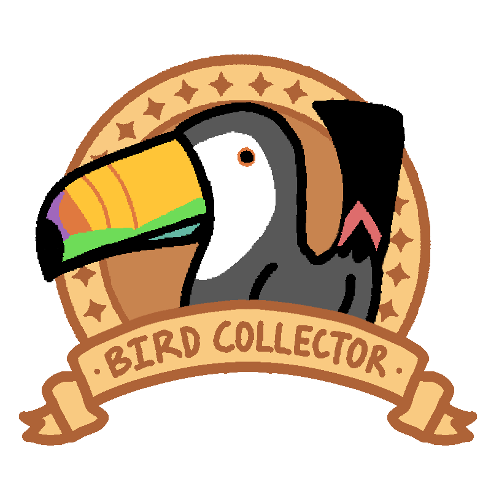

# Webslingrz Final Project: Bird Collector 🐔🐔


# Team
* Brian Zou [Brian's Github](https://github.com/brianzou03)
* Andrew Bao [Andrew's Github](https://github.com/andrew-bao)
* Jasmine Fan [Jasmine's Github](https://github.com/jasmine7310)
* Bryant To [Bryant's Github](https://github.com/bryantto08)

# Link to Deployed Website through Digital Ocean
### [Bird Collector Web App Game](http://147.182.221.242:5001/login)

# About

### Silly game about silly birds!🐔
Do you like birds but you wish they wouldn't fly away the moment you got near them? Do you wonder if there is a way to interact with these silly goobers at comfort of your desk? Then this game is for you!  
  
Birds will spawn on your screen. Click them to add them to your collection!  
  
Keep track of the birds you collected with the Birdiary!  
  
Just like in real life, your collected birds will generate gold.  

Different birds have different degrees of rarity. Try and collect them all!

The rarer the bird, the better the gold they generate.
  
Use this gold to buy decoration to drip out your desktop and attract rarer birds!  
  
Buy the Froggy Fountain to become worthy of the bird who stands above all other birds...  

# Subsystems Images
* Mongodb: [Docker Hub](https://hub.docker.com/_/mongo)
* Flask/Pygame: [Docker Hub](https://hub.docker.com/r/bt2181/webslingerz)

# Task Board
View our task board [here](https://github.com/orgs/software-students-spring2025/projects/234/views/2)

# Example .env
Please add an .env into the backend directory before running, an example is shown below:
```
SECRET_KEY=devsecret
MONGO_URI=mongodb://localhost:27017/birdgame
```

# How to Run via Docker
### Full Application
```
docker compose up --build
```
# Running without Docker
## Web App (Mac)
```
python3 -m venv venv
source venv/bin/activate 
cd backend
pip install -r requirements.txt
brew tap mongodb/brew
brew uninstall mongodb-community
brew cleanup
brew install mongodb/brew/mongodb-community
brew services stop mongodb/brew/mongodb-community
brew services cleanup
brew services start mongodb/brew/mongodb-community
cd ..
./venv/bin/python backend/app.py
```

## Web App (Windows)
```
python -m venv venv
venv/bin/activate 
cd backend
pip install -r requirements.txt
Install Mongodb and ensure it is running in services.msc
python app.py
```

Visit localhost via: http://127.0.0.1:5001

# Running bird game standalone
```
python3 -m venv venv
source venv/bin/activate 
./venv/bin/python backend/bird_game.py
```

### Unit tests for web app
A note about unit testing: bird_game.py is excluded via .coveragerc as bird_game contains advanced logic such as audio and visuals that are not meant to be unit tested

#### coverage testing (run from backend directory)
```
coverage run -m pytest
coverage html
open htmlcov/index.html
```

#### test_all.py
* test_home_redirect
* test_register_flow
* test_login_flow
* test_play_flow
* test_logout_flow
* test_serve_game_assets_real_file
* test_load_scaled_image
* test_greyscale_surface

#### test_auth.py
* test_register_existing_user
* test_register_new_user
* test_login_invalid
* test_login_valid
* test_logout
* test_register
* test_register_get
* test_register_existing_user

#### test_flask_app.py
* test_home_redirect
* test_login_page_loads
* test_register_page_loads
* test_dashboard_requires_login
* test_birds_requires_login
* test_play_requires_login
* test_build_game_requires_login

#### test_game_logic.py
* test_add_error_message_and_limit
* test_draw_error_messages
* test_remove_error_message
* test_greyscale_surface_success
* test_greyscale_surface_fail
* test_load_scaled_image_success
* test_load_scaled_image_fail
* test_bird_init
* test_show_birdiary
* test_show_birdiary_exception
* test_show_birdiary_scroll
* test_show_store
* test_show_store_exception
* test_show_store_purchase
* test_show_store_not_enough_gold
* test_main_startup
* test_main_loop_exception
* test_main_fatal_error
* test_main_open_birdiary
* test_main_open_store
* test_main_purchase_all_decor

#### test_utilities.py
* test_load_scaled_image_success
* test_greyscale_surface

# Technology
* Python / Flask
* PyGame
* Docker
* MongoDB
* Digital Ocean

# Future Expansion
* Add in more background options as a purchasable item, similar to furniture
* Carry over gamestate information to the other tabs in the website, allowing you to
view your bird collection, gold, furniture purchased, and other statistics
* Create more dynamic birds with animated assets 
* Establish bird behavior, allowing them to move to different locations instead of spawning in fixed locations
* Instead of using the mouse to collect birds, implement hand tracking ML to collect birds and put them in a bag

